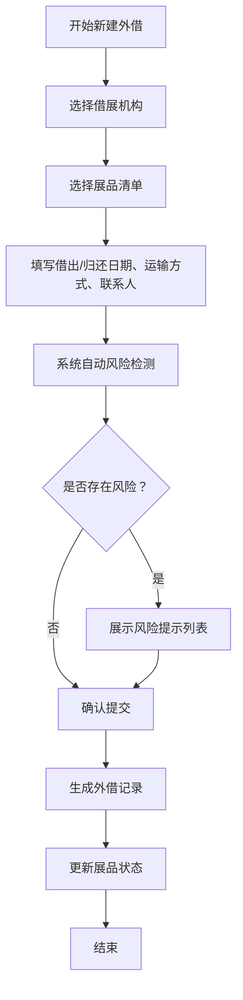

## 1. 产品概述

博物馆展品外借管理系统，面向小型博物馆的展品借展业务管理。解决传统表格管理存在的时间冲突遗漏、运输要求忽视、保险风险不可控等问题。

- 核心目标：系统化管理展品外借全流程，自动识别并预警各类风险，提升借展管理效率和安全性
- 目标用户：博物馆展品管理员、借展协调人员

## 2. 核心功能

### 2.1 用户角色

本系统为博物馆内部使用的单用户系统，不区分多角色权限，所有功能对管理员开放。

### 2.2 功能模块

1. **展品管理页面**：展品信息列表、新增/编辑/删除展品、状态筛选
2. **借展机构管理**：机构信息维护、保险额度管理
3. **外借记录管理**：新建借展申请、外借记录列表、详情查看
4. **风险中心页面**：风险集中展示、严重程度筛选、风险标记处理
5. **运输安排页面**：按日期展示出/还货排期、时间线视图

### 2.3 页面详情

| 页面名称 | 模块名称 | 功能描述 |
|---------|---------|---------|
| 展品管理 | 展品列表 | 表格展示全部展品，支持按类别、状态筛选，搜索展品名称 |
| 展品管理 | 新增/编辑展品 | 表单字段：名称、类别、保险估值、是否需要恒温运输、当前状态 |
| 借展机构 | 机构列表 | 展示机构名称、联系方式、可承担保险额度 |
| 借展机构 | 新增/编辑机构 | 表单字段：机构名称、联系人、联系电话、可承担保险额度 |
| 外借记录 | 记录列表 | 展示借展机构、展品清单、借出/归还日期、状态 |
| 外借记录 | 新建借展 | 多步表单：选择机构→选择展品→填写日期/运输/联系人→系统自动风险校验→确认提交 |
| 风险中心 | 风险列表 | 卡片式展示所有未处理风险，支持按严重程度（高/中/低）筛选 |
| 风险中心 | 风险详情与处理 | 展示风险描述、关联展品/借展、标记"已处理" |
| 运输安排 | 时间轴视图 | 按日期分组展示近期（未来30天）需要发出和归还的展品清单 |

## 3. 核心流程

### 3.1 新建外借流程

管理员录入借展信息 → 系统自动检测风险 → 展示风险提示 → 用户确认后提交 → 生成外借记录 → 展品状态更新为"已借出"

### 3.2 风险检测规则

1. **时间冲突风险（高）**：同一件展品在借出日期范围内已存在其他外借记录
2. **恒温运输风险（中）**：展品要求恒温运输但选择了普通运输方式
3. **保险额度不足风险（高）**：展品保险估值超过借展机构可承担的保险额度
4. **逾期未归还预警（中）**：外借记录超过归还日期仍未标记归还

## 4. 用户界面设计

### 4.1 设计风格

- **主色调**：深棕色系（#5D4037），传达博物馆的沉稳与文化质感
- **辅助色**：暖金色（#FFB300）用于强调和高亮
- **警示色**：红色（#C62828）高风险、橙色（#EF6C00）中风险、蓝色（#1565C0）低风险
- **按钮风格**：圆角 6px，主按钮使用深棕色填充配白色文字，hover 时微亮
- **字体**：Noto Serif SC（标题）+ Noto Sans SC（正文），中文衬线体搭配无衬线体体现文化气息
- **布局风格**：左侧导航栏 + 右侧内容区，卡片式信息展示，大量留白
- **图标风格**：Lucide 线性图标，统一描边宽度

### 4.2 页面设计概述

| 页面名称 | 模块名称 | UI 元素 |
|---------|---------|---------|
| 展品管理 | 列表区 | 顶部搜索+筛选栏，下方数据表格，行悬停高亮 |
| 外借记录 | 新建表单 | 分步进度条指示，表单卡片分组，风险提示浮层 |
| 风险中心 | 风险卡片 | 按严重程度用不同色条标记左侧边，卡片包含风险描述、关联信息、处理按钮 |
| 运输安排 | 时间轴 | 日期分组标题 + 当日运输卡片，发出用绿色标记、归还用蓝色标记 |

### 4.3 响应式

桌面端优先设计（最小宽度 1280px），左侧固定导航栏宽度 240px。在平板尺寸下导航栏可折叠为图标模式。移动端简化为顶部导航。
