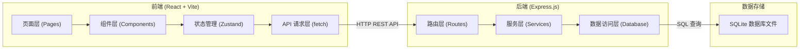
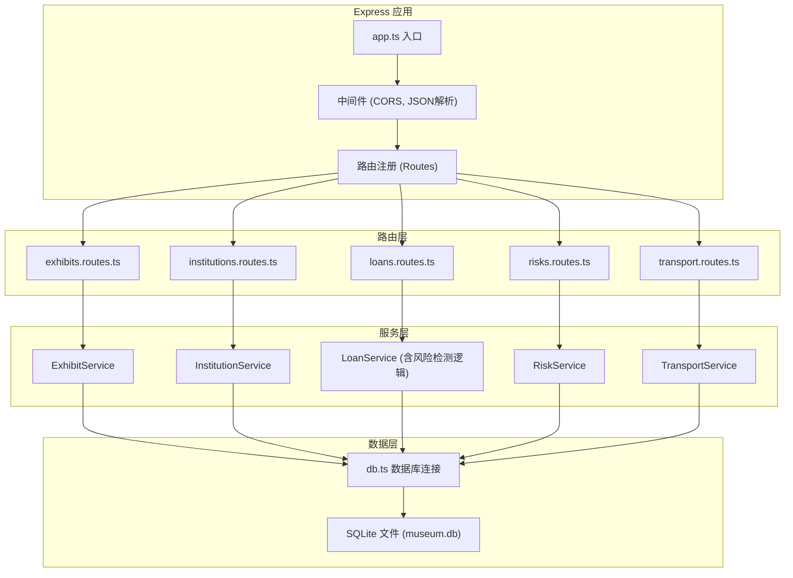
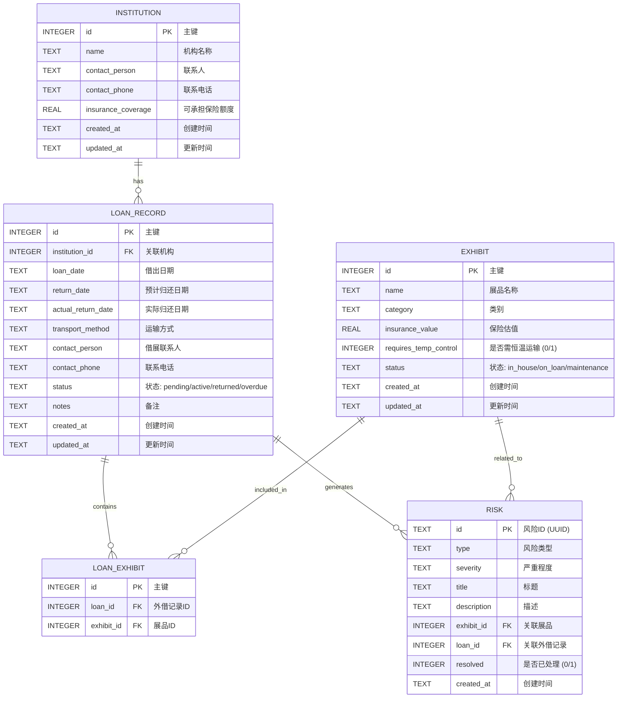

## 1. 架构设计



## 2. 技术选型说明

- **前端框架**：React 18 + TypeScript
- **构建工具**：Vite 5
- **样式方案**：Tailwind CSS 3
- **状态管理**：Zustand
- **路由**：React Router DOM 6
- **图标库**：Lucide React
- **后端框架**：Express.js 4 + TypeScript
- **数据库**：SQLite（通过 better-sqlite3 驱动）
- **初始化模板**：react-express-ts（前后端一体）

选择理由：
1. React + TypeScript 组合提供类型安全和良好的开发体验
2. Express.js 轻量简洁，适合小型本地应用
3. SQLite 零配置、文件型数据库，无需额外安装服务，完全满足用户"本地能跑"的需求
4. 前后端统一使用 TypeScript，便于类型共享

## 3. 路由定义

### 前端路由

| 路由路径 | 页面名称 | 用途 |
|---------|---------|------|
| / | 首页概览 | 系统统计、快速入口 |
| /exhibits | 展品管理 | 展品列表、新增、编辑 |
| /institutions | 机构管理 | 借展机构列表、新增、编辑 |
| /loans | 外借记录 | 外借记录列表、新建借展 |
| /loans/new | 新建外借 | 多步新建外借记录表单 |
| /risks | 风险中心 | 风险列表、筛选、标记处理 |
| /transport | 运输安排 | 按日期展示运输排期 |

### 后端 API 路由

| 方法 | 路径 | 用途 |
|-----|------|------|
| GET | /api/exhibits | 获取展品列表（支持筛选） |
| GET | /api/exhibits/:id | 获取单个展品详情 |
| POST | /api/exhibits | 新增展品 |
| PUT | /api/exhibits/:id | 更新展品信息 |
| DELETE | /api/exhibits/:id | 删除展品 |
| GET | /api/institutions | 获取机构列表 |
| GET | /api/institutions/:id | 获取单个机构详情 |
| POST | /api/institutions | 新增机构 |
| PUT | /api/institutions/:id | 更新机构信息 |
| DELETE | /api/institutions/:id | 删除机构 |
| GET | /api/loans | 获取外借记录列表 |
| GET | /api/loans/:id | 获取单条外借记录详情 |
| POST | /api/loans | 新建外借记录（含风险校验） |
| PUT | /api/loans/:id | 更新外借记录 |
| PUT | /api/loans/:id/status | 更新外借状态（标记归还等） |
| GET | /api/risks | 获取所有风险（支持按严重程度筛选） |
| POST | /api/risks/:id/resolve | 标记风险已处理 |
| GET | /api/transport/schedule | 获取运输排期（按日期分组） |
| POST | /api/loans/validate | 预校验外借风险（用于新建表单实时校验） |

## 4. API 接口类型定义

```typescript
// 展品
interface Exhibit {
  id: number;
  name: string;
  category: string;
  insuranceValue: number;
  requiresTemperatureControl: boolean;
  status: 'in_house' | 'on_loan' | 'maintenance';
  createdAt: string;
  updatedAt: string;
}

// 借展机构
interface Institution {
  id: number;
  name: string;
  contactPerson: string;
  contactPhone: string;
  insuranceCoverage: number;
  createdAt: string;
  updatedAt: string;
}

// 外借记录
interface LoanRecord {
  id: number;
  institutionId: number;
  institutionName?: string;
  exhibitIds: number[];
  exhibits?: Exhibit[];
  loanDate: string;
  returnDate: string;
  actualReturnDate?: string;
  transportMethod: 'standard' | 'temperature_controlled' | 'special';
  contactPerson: string;
  contactPhone: string;
  status: 'pending' | 'active' | 'returned' | 'overdue';
  notes?: string;
  createdAt: string;
  updatedAt: string;
}

// 风险
interface RiskItem {
  id: string;
  type: 'time_conflict' | 'temp_control' | 'insurance' | 'overdue';
  severity: 'high' | 'medium' | 'low';
  title: string;
  description: string;
  exhibitId?: number;
  loanId?: number;
  resolved: boolean;
  createdAt: string;
}

// 运输排期
interface TransportItem {
  date: string;
  type: 'outbound' | 'return';
  loanId: number;
  institutionName: string;
  exhibits: Exhibit[];
}
```

## 5. 服务端架构



## 6. 数据模型

### 6.1 ER 图



### 6.2 DDL 语句

```sql
-- 展品表
CREATE TABLE IF NOT EXISTS exhibits (
  id INTEGER PRIMARY KEY AUTOINCREMENT,
  name TEXT NOT NULL,
  category TEXT NOT NULL,
  insurance_value REAL NOT NULL DEFAULT 0,
  requires_temp_control INTEGER NOT NULL DEFAULT 0,
  status TEXT NOT NULL DEFAULT 'in_house',
  created_at TEXT NOT NULL DEFAULT (datetime('now')),
  updated_at TEXT NOT NULL DEFAULT (datetime('now'))
);

-- 机构表
CREATE TABLE IF NOT EXISTS institutions (
  id INTEGER PRIMARY KEY AUTOINCREMENT,
  name TEXT NOT NULL,
  contact_person TEXT NOT NULL,
  contact_phone TEXT NOT NULL,
  insurance_coverage REAL NOT NULL DEFAULT 0,
  created_at TEXT NOT NULL DEFAULT (datetime('now')),
  updated_at TEXT NOT NULL DEFAULT (datetime('now'))
);

-- 外借记录表
CREATE TABLE IF NOT EXISTS loan_records (
  id INTEGER PRIMARY KEY AUTOINCREMENT,
  institution_id INTEGER NOT NULL,
  loan_date TEXT NOT NULL,
  return_date TEXT NOT NULL,
  actual_return_date TEXT,
  transport_method TEXT NOT NULL DEFAULT 'standard',
  contact_person TEXT NOT NULL,
  contact_phone TEXT NOT NULL,
  status TEXT NOT NULL DEFAULT 'pending',
  notes TEXT,
  created_at TEXT NOT NULL DEFAULT (datetime('now')),
  updated_at TEXT NOT NULL DEFAULT (datetime('now')),
  FOREIGN KEY (institution_id) REFERENCES institutions(id)
);

-- 外借-展品关联表
CREATE TABLE IF NOT EXISTS loan_exhibits (
  id INTEGER PRIMARY KEY AUTOINCREMENT,
  loan_id INTEGER NOT NULL,
  exhibit_id INTEGER NOT NULL,
  FOREIGN KEY (loan_id) REFERENCES loan_records(id),
  FOREIGN KEY (exhibit_id) REFERENCES exhibits(id),
  UNIQUE(loan_id, exhibit_id)
);

-- 风险表
CREATE TABLE IF NOT EXISTS risks (
  id TEXT PRIMARY KEY,
  type TEXT NOT NULL,
  severity TEXT NOT NULL,
  title TEXT NOT NULL,
  description TEXT NOT NULL,
  exhibit_id INTEGER,
  loan_id INTEGER,
  resolved INTEGER NOT NULL DEFAULT 0,
  created_at TEXT NOT NULL DEFAULT (datetime('now')),
  FOREIGN KEY (exhibit_id) REFERENCES exhibits(id),
  FOREIGN KEY (loan_id) REFERENCES loan_records(id)
);

CREATE INDEX IF NOT EXISTS idx_risks_resolved ON risks(resolved);
CREATE INDEX IF NOT EXISTS idx_risks_severity ON risks(severity);
CREATE INDEX IF NOT EXISTS idx_loan_records_dates ON loan_records(loan_date, return_date);
```

### 6.3 初始化示例数据

系统启动时自动检测数据库是否为空，若为空则插入示例数据：
- 展品：约8-10件，覆盖不同类别（青铜器、书画、陶瓷、玉器等），部分设置需要恒温
- 机构：约3-5个借展机构，设置不同保险额度
- 外借记录：约2-3条，包含一条逾期和一条正常进行中的，用于触发风险演示
